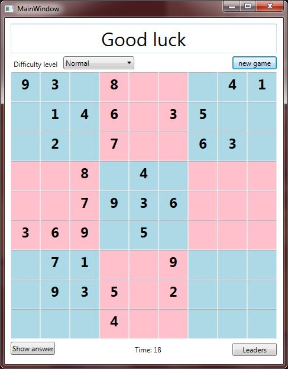

#Sudoku
Small version of Sudoku game (simplified clone).

Made as an C# Programming III module project.

Written in Visual Studio 2013.

## Overview

The Game presents player with three difficulty levels:
- Easy
- Normal
- Hard

Each level is generated based on *seed* by performing a set of permutations, which does not affect correctness of given puzzle. (This algorithm does not guarantee *uniqueness* of solution.)

Game ends when player either choose to reveal the answer or fills all the fields with correct numbers (*noncontradictory*). Score is recorded based on time taken to find solution and stored in separate text file.

### Screenshot

## Possible improvements
* Highlighting contradictory answers
* Option to Save/Load game
* Input method with drag and drop numbers
* Counter for numbers left

## Reference
[Sudoku Puzzles Generating: from Easy to Evil](http://zhangroup.aporc.org/images/files/Paper_3485.pdf)
